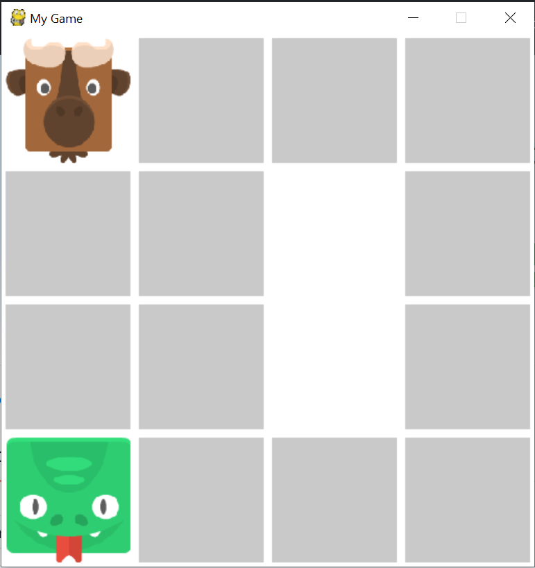

# Matching-Animals

### About the game
The grid contains 16 empty tiles that cover 8 pairs of different animal images. The player can choose any empty tile to see the image hidden and try to match with the same image hidden in another tile. However, only two images can be presented at a time. After flipping an image, try to remember where the tile is to flip two same images at once. The matched images will disappear after chosen. You will win if you can clear all 8 pairs of images.

### Screenshot
This is how the game looks like:

### Play it!
You can download the game (Matching-animals.zip) from [Release](https://github.com/socolachaymo/Matching-Animals/releases) and run the app.exe file 
